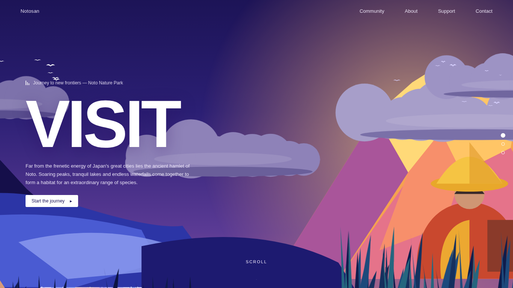
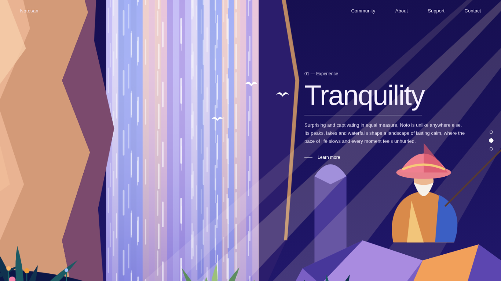
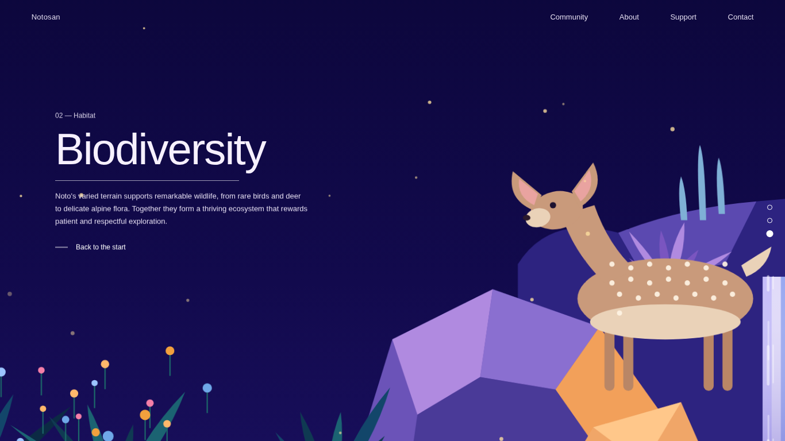

# Notosan | Smooth Scroll Nature Journey

A cinematic, scroll-driven parallax website built with **vanilla HTML, CSS and JavaScript**. Scroll through three illustrated scenes of Japan's Noto Nature Park, with layered depth, animated waterfalls, drifting clouds, flying birds and wildlife. No frameworks, no build step, and no image assets.



> **Note:** This is an independent learning project inspired by a YouTube video. See [Inspiration and Credits](#inspiration-and-credits).

---

## Table of Contents

- [Overview](#overview)
- [Features](#features)
- [Preview](#preview)
- [Tech Stack](#tech-stack)
- [Getting Started](#getting-started)
- [Project Structure](#project-structure)
- [How It Works](#how-it-works)
- [Customization](#customization)
- [Browser Support](#browser-support)
- [Accessibility](#accessibility)
- [Inspiration and Credits](#inspiration-and-credits)
- [License](#license)

---

## Overview

Notosan is a front-end showcase of scroll-linked storytelling. A single pinned stage stays fixed in the viewport while scroll position drives the transitions between three scenes: **Visit**, **Tranquility** and **Biodiversity**. Every illustration is generated at runtime as SVG, which keeps the project small (about 40 KB of source), resolution independent and easy to modify.

## Features

- **Scroll-driven scenes.** Scenes cross-fade as you scroll, while text slides, blurs and fades in a staggered sequence.
- **Multi-layer parallax.** Each layer has its own depth value, so nearer layers move and zoom more than distant ones.
- **Pointer parallax.** Layers respond subtly to mouse movement for added depth.
- **Smoothed scrolling.** Scroll progress is eased in JavaScript for a fluid, weighted feel.
- **Procedural SVG artwork.** Mountains, cloud banks, waterfalls, foliage, characters and wildlife are generated in code, with a seeded random generator so the result is identical on every load.
- **Ambient animation.** Flocks of birds cross the frame, waterfalls flow, grass sways, fireflies float and light rays pulse.
- **Navigation.** Header links, a side section indicator and in-page buttons all scroll smoothly to the target scene.
- **Responsive layout.** Typography and layout adapt from mobile to large desktop screens.
- **Zero dependencies.** Pure HTML, CSS and JavaScript. The only external resource is an optional web font.

## Preview

|            Visit            |               Tranquility               |               Biodiversity                |
| :-------------------------: | :-------------------------------------: | :---------------------------------------: |
|  |  |  |

## Tech Stack

| Layer      | Technology                                                                          |
| ---------- | ----------------------------------------------------------------------------------- |
| Markup     | HTML5                                                                               |
| Styling    | CSS3 (custom properties, `clamp()`, `mix-blend-mode`, keyframe animations)          |
| Logic      | JavaScript (ES6+), no libraries                                                     |
| Graphics   | Inline SVG generated at runtime                                                     |
| Typography | [Hanken Grotesk](https://fonts.google.com/specimen/Hanken+Grotesk) via Google Fonts |

## Getting Started

### Prerequisites

A modern web browser. No Node.js, package manager or build tool is required.

### Run locally

1. Clone or download this repository.

   ```bash
   git clone https://github.com/<your-username>/notosan-smooth-scroll-parallax.git
   cd notosan-smooth-scroll-parallax
   ```

2. Open `index.html` in your browser by double-clicking it.

Alternatively, serve the folder with any static server:

```bash
# Python 3
python -m http.server 8000
# then visit http://localhost:8000
```

> An internet connection is only needed to load the web font. Without it, the site falls back to a system sans-serif typeface and works as normal.

## Project Structure

```text
notosan-smooth-scroll-parallax/
├── index.html        # Page structure: header, navigation, scenes and layers
├── css/
│   └── style.css     # Design tokens, layout, typography and animations
├── js/
│   └── main.js       # SVG artwork generation, scroll engine and navigation
├── docs/             # Screenshots used in this README
├── LICENSE           # MIT License and attribution notice
└── README.md
```

## How It Works

1. **Pinned stage.** `.scroll-track` provides the scrollable height (`500vh`). Inside it, `.scroll-stage` uses `position: sticky` to stay fixed in the viewport.
2. **Scroll progress.** The script converts scroll position into a scene progress value between `0` and the last scene index. This value is eased on every animation frame to produce smooth motion.
3. **Scene transitions.** For each scene, the distance from the current progress controls opacity, visibility and pointer events, so only the relevant scenes are rendered and interactive.
4. **Layer parallax.** Every `.layer` declares a `data-depth` between `0` and `1`. Depth determines vertical travel, horizontal pointer response and zoom.
5. **Staggered text.** Elements inside `.scene-content` carry a `data-order` attribute that offsets their motion and blur, producing a cascading effect.
6. **Generated artwork.** Helper functions such as `drawCloudBank`, `drawWaterfall`, `drawLeafFan` and `drawBirdFlock` compose each scene from SVG paths. A seeded random function keeps the output deterministic.

## Customization

| Goal                                    | Where to change it                                               |
| --------------------------------------- | ---------------------------------------------------------------- |
| Make the journey longer or shorter      | `--scroll-length` in `css/style.css`                             |
| Make scrolling feel snappier or heavier | `PROGRESS_EASING` in `js/main.js` (higher is snappier)           |
| Adjust bird speed                       | `flock-cross` duration in `css/style.css` (`.bird-flock`)        |
| Adjust wing-flap speed                  | `wing-flap` duration in `css/style.css` (`.bird`)                |
| Change the strength of depth effects    | `data-depth` values in `index.html`                              |
| Edit the copy                           | Text inside `.scene-content` blocks in `index.html`              |
| Add or modify illustrations             | Scene artwork section in `js/main.js`                            |
| Change the palette                      | Fill colors in `js/main.js` and sky gradients in `css/style.css` |

## Browser Support

Designed for current versions of Chrome, Edge, Firefox and Safari. The project uses CSS `inset`, `translate`, `clamp()` and `mix-blend-mode`, which are supported in all evergreen browsers.

## Accessibility

- Decorative SVG layers are hidden from assistive technology with `aria-hidden="true"`.
- Interactive elements are native `button` and `a` elements with visible keyboard focus styles.
- The section indicator buttons include descriptive `aria-label` values.
- Animations and smoothing are disabled when the user's system requests reduced motion (`prefers-reduced-motion`).

## Inspiration and Credits

This project was created after watching the following YouTube video, which served as visual and conceptual inspiration:

- **Video:** SMOOTH SCROLL 3D Animated Website Design | CSS & JavaScript Magic!
- **Creator:** @code_with_Me22
- **Link:** [YOUTUBE_VIDEO_URL]

The code and all SVG illustrations in this repository were written independently, and no source code or artwork from the video has been reused. This project is not affiliated with or endorsed by the video's creator or by YouTube.

Typography: [Hanken Grotesk](https://fonts.google.com/specimen/Hanken+Grotesk), licensed under the SIL Open Font License 1.1.

## License

Distributed under the MIT License. See [`LICENSE`](LICENSE) for the full text and the attribution notice.
